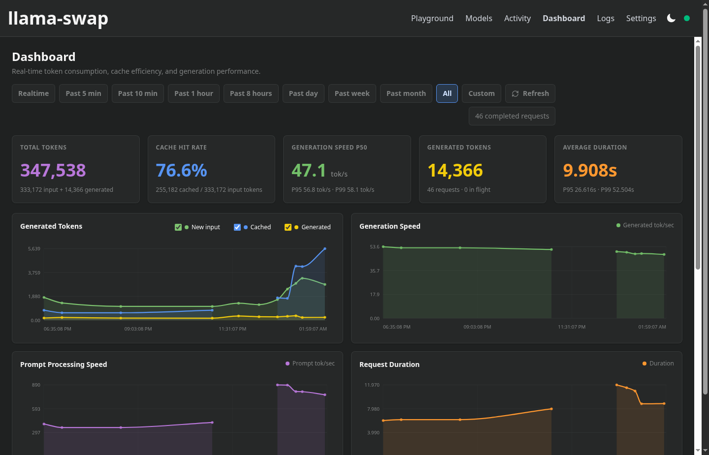
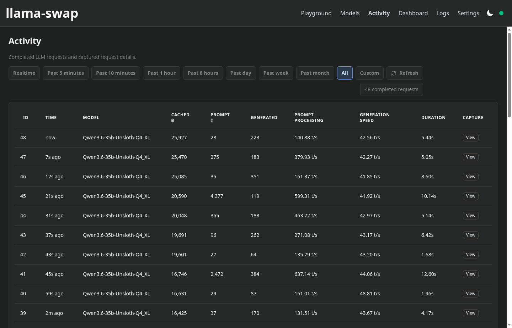
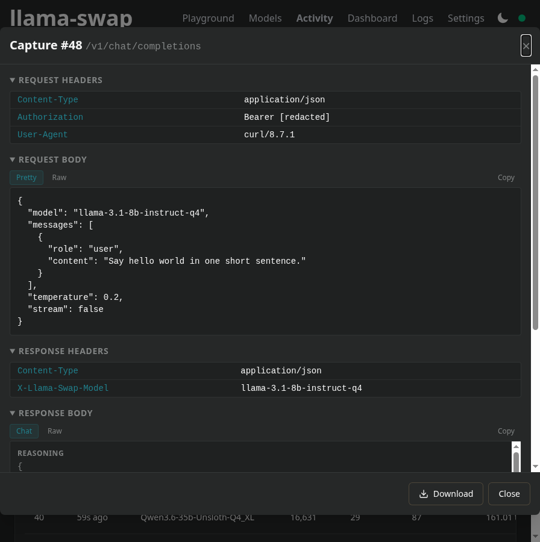
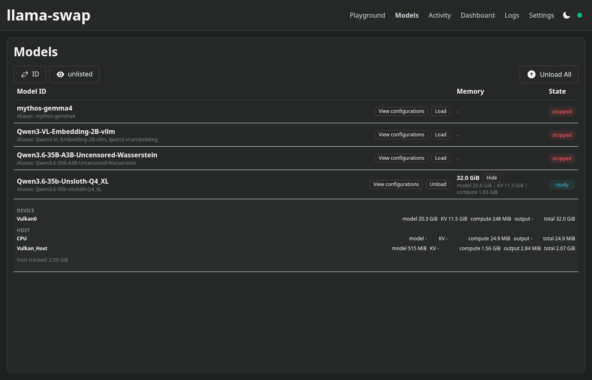
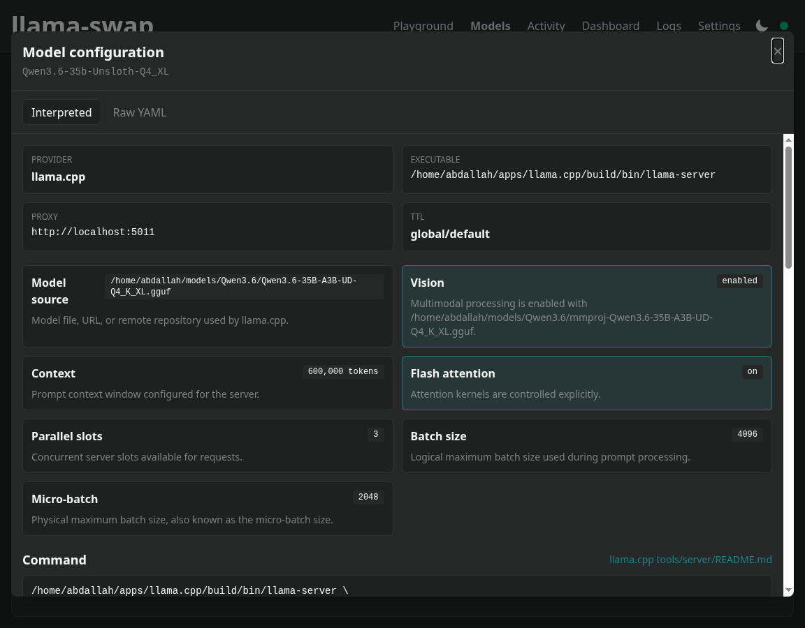
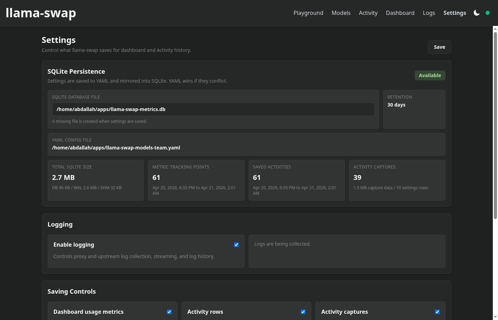

# llama-swap supercharged

This fork builds on [mostlygeek/llama-swap](https://github.com/mostlygeek/llama-swap) with a deeper operations dashboard, persisted usage history, request capture exports, runtime persistence controls, llama.cpp memory reporting, and model configuration inspection.

Run multiple generative AI models on your machine and hot-swap between them on demand. llama-swap works with any OpenAI and Anthropic API compatible server and is used by thousands of people to power their local AI workflows.

Built in Go for performance and simplicity, llama-swap is easy to set up and runs as one binary with one configuration file. The supercharged features use an embedded SQLite database, so historical metrics and Activity rows do not require a separate service.

## Supercharged highlights

- Persistent dashboard metrics in SQLite, with realtime, preset historical ranges, custom time windows, row limits, and retention controls.
- Rich usage analytics: total tokens, new prompt tokens, cached prompt tokens, cache hit rate, generation speed, prompt processing speed, request duration, token composition, histograms, and per-model drilldowns.
- Persisted Activity history with optional request/response capture storage, per-field retention controls, redacted headers, and JSON capture downloads.
- Runtime Settings page for SQLite database path, logging, usage persistence, Activity persistence, capture persistence, redaction, saved Activity fields, YAML writeback, and YAML-vs-SQLite conflict visibility.
- Models page upgrades for llama.cpp memory tracking, including device and host totals plus model, KV, compute, output, and runtime breakdowns parsed from llama.cpp loading logs.
- Model configuration viewer that resolves aliases and shows command, proxy, TTL, environment, raw YAML, and interpreted llama-server options for context, batching, offload, and vision settings.
- More accurate token accounting: cached prompt tokens are separated from newly processed input tokens, with cache hit rate exposed in the UI and metrics API.
- Per-model `excludeFromMetrics` support for hiding internal, test, or utility models from Activity and dashboard statistics.

## Features:

- ✅ Easy to deploy and configure: one binary, one configuration file, no external services
- ✅ On-demand model switching
- ✅ Use any local OpenAI compatible server (llama.cpp, vllm, tabbyAPI, stable-diffusion.cpp, etc.)
  - future proof, upgrade your inference servers at any time.
- ✅ OpenAI API supported endpoints:
  - `v1/completions`
  - `v1/chat/completions`
  - `v1/responses`
  - `v1/embeddings`
  - `v1/audio/speech` ([#36](https://github.com/mostlygeek/llama-swap/issues/36))
  - `v1/audio/transcriptions` ([docs](https://github.com/mostlygeek/llama-swap/issues/41#issuecomment-2722637867))
  - `v1/audio/voices`
  - `v1/images/generations`
  - `v1/images/edits`
- ✅ Anthropic API supported endpoints:
  - `v1/messages`
  - `v1/messages/count_tokens`
- ✅ llama-server (llama.cpp) supported endpoints
  - `v1/rerank`, `v1/reranking`, `/rerank`
  - `/infill` - for code infilling
  - `/completion` - for completion endpoint
- ✅ SDAPI via [stable-diffusion.cpp's server](https://github.com/leejet/stable-diffusion.cpp/tree/master/examples/server)
  - `/sdapi/v1/txt2img`
  - `/sdapi/v1/img2img`
  - `/sdapi/v1/loras` - requires `model` in request body to fetch the correct loras
- ✅ llama-swap API
  - `/ui` - web UI
  - `/upstream/:model_id` - direct access to upstream server ([demo](https://github.com/mostlygeek/llama-swap/pull/31))
  - `/models/unload` - manually unload running models ([#58](https://github.com/mostlygeek/llama-swap/issues/58))
  - `/running` - list currently running models ([#61](https://github.com/mostlygeek/llama-swap/issues/61))
  - `/log` - remote log monitoring
  - `/api/metrics` - realtime and persisted historical metrics with `range`, `from`, `to`, `limit`, and `scope`
  - `/api/captures/:id` - compressed request/response capture retrieval
  - `/api/settings/persistence` - runtime persistence and logging controls
  - `/api/models/config/:model_id` - resolved model configuration and source YAML
  - `/health` - just returns "OK"
- ✅ API Key support - define keys to restrict access to API endpoints
- ✅ Customizable
  - Run concurrent models with a custom DSL swap matrix ([#643](https://github.com/mostlygeek/llama-swap/issues/643))
  - Automatic unloading of models after timeout by setting a `ttl`
  - Reliable Docker and Podman support using `cmd` and `cmdStop` together
  - Preload models on startup with `hooks` ([#235](https://github.com/mostlygeek/llama-swap/pull/235))
  - Persist metrics and Activity history in SQLite, with retention and query limits
  - Hide selected models from metrics with `excludeFromMetrics`

### Supercharged Web UI

llama-swap includes a real time web interface with a playground for testing out all sorts of local models. This fork adds a dedicated dashboard, persistent Activity history, capture export tooling, model memory reporting, resolved configuration inspection, and runtime Settings controls.

#### Dashboard

Track token consumption, cache efficiency, performance, historical ranges, global composition, and per-model drilldowns from one page.



#### Activity History

Browse completed requests across realtime or persisted historical ranges, including cached tokens, new input tokens, generated tokens, speed, duration, and capture availability.



#### Capture Export

Open saved captures, inspect request/response metadata, pretty-print JSON, extract streaming chat text, copy bodies, and download a structured JSON export.



#### Model Memory

See loaded llama.cpp memory usage by model, with device and host totals and per-component detail for model weights, KV cache, compute buffers, output buffers, and runtime overhead.



#### Model Configuration

Open any model configuration, resolve aliases to the real model ID, inspect the command and raw YAML, and interpret llama-server flags into readable categories.



#### Persistence Settings

Control what gets saved without restarting: SQLite path, logging, dashboard metrics, Activity rows, capture persistence, header redaction, saved Activity fields, YAML writeback, and conflict handling.



## Installation

llama-swap can be installed in multiple ways

1. Docker
2. Homebrew (OSX and Linux)
3. WinGet
4. From release binaries
5. From source

> [!NOTE]
> Docker, Homebrew, WinGet, and release binary instructions below point at the upstream llama-swap distribution channels unless this fork publishes matching artifacts. Build this fork from source to use the supercharged dashboard, persistence, capture export, memory, and configuration features.

### Docker Install ([download images](https://github.com/mostlygeek/llama-swap/pkgs/container/llama-swap))

Nightly container images with llama-swap and llama-server are built for multiple platforms (cuda, vulkan, intel, etc.) including [non-root variants with improved security](docs/container-security.md).
The stable-diffusion.cpp server is also included for the musa and vulkan platforms.

```shell
$ docker pull ghcr.io/mostlygeek/llama-swap:cuda

# run with a custom configuration and models directory
$ docker run -it --rm --runtime nvidia -p 9292:8080 \
 -v /path/to/models:/models \
 -v /path/to/custom/config.yaml:/app/config.yaml \
 ghcr.io/mostlygeek/llama-swap:cuda

# configuration hot reload supported with a
# directory volume mount
$ docker run -it --rm --runtime nvidia -p 9292:8080 \
 -v /path/to/models:/models \
 -v /path/to/custom/config.yaml:/app/config.yaml \
 -v /path/to/config:/config \
 ghcr.io/mostlygeek/llama-swap:cuda -config /config/config.yaml -watch-config
```

<details>
<summary>
more examples
</summary>

```shell
# pull latest images per platform
docker pull ghcr.io/mostlygeek/llama-swap:cpu
docker pull ghcr.io/mostlygeek/llama-swap:cuda
docker pull ghcr.io/mostlygeek/llama-swap:vulkan
docker pull ghcr.io/mostlygeek/llama-swap:intel
docker pull ghcr.io/mostlygeek/llama-swap:musa

# tagged llama-swap, platform and llama-server version images
docker pull ghcr.io/mostlygeek/llama-swap:v166-cuda-b6795

# non-root cuda
docker pull ghcr.io/mostlygeek/llama-swap:cuda-non-root

```

</details>

### Homebrew Install (macOS/Linux)

```shell
brew tap mostlygeek/llama-swap
brew install llama-swap
llama-swap --config path/to/config.yaml --listen localhost:8080
```

### WinGet Install (Windows)

> [!NOTE]
> WinGet is maintained by community contributor [Dvd-Znf](https://github.com/Dvd-Znf) ([#327](https://github.com/mostlygeek/llama-swap/issues/327)). It is not an official part of llama-swap.

```shell
# install
C:\> winget install llama-swap

# upgrade
C:\> winget upgrade llama-swap
```

### Pre-built Binaries

Binaries are available on the [release](https://github.com/mostlygeek/llama-swap/releases) page for Linux, Mac, Windows and FreeBSD.

### Building from source

1. Building requires Go and Node.js (for UI).
1. `git clone https://github.com/abdallah-ali-abdallah/llama-swap-supercharged.git`
1. `make clean all`
1. look in the `build/` subdirectory for the llama-swap binary

## Configuration

```yaml
# minimum viable config.yaml

models:
  model1:
    cmd: llama-server --port ${PORT} --model /path/to/model.gguf
```

That's all you need to get started:

1. `models` - holds all model configurations
2. `model1` - the ID used in API calls
3. `cmd` - the command to run to start the server.
4. `${PORT}` - an automatically assigned port number

Almost all configuration settings are optional and can be added one step at a time:

- Advanced features
  - `matrix` to run concurrent models with a custom swap logic DSL
  - `hooks` to run things on startup
  - `macros` reusable snippets
  - `metricsDBPath` to choose where SQLite dashboard and Activity history are stored
  - `metricsRetentionDays` to clean old persisted metrics automatically
  - `metricsQueryMaxRows` to cap historical dashboard and Activity queries
  - `usageMetricsPersistence` to enable or disable persisted dashboard usage metrics
  - `activityPersistence` to enable or disable persisted Activity rows
  - `activityCapturePersistence` to persist request/response captures when capture buffering is enabled
  - `captureRedactHeaders` to redact sensitive headers before saving captures
  - `activityFields` to choose which model, token, speed, and duration fields are saved for future Activity rows
  - `loggingEnabled` to enable or fully disable UI log collection and streaming
- Model customization
  - `ttl` to automatically unload models
  - `aliases` to use familiar model names (e.g., "gpt-4o-mini")
  - `env` to pass custom environment variables to inference servers
  - `cmdStop` gracefully stop Docker/Podman containers
  - `useModelName` to override model names sent to upstream servers
  - `${PORT}` automatic port variables for dynamic port assignment
  - `filters` rewrite parts of requests before sending to the upstream server
  - `excludeFromMetrics` to keep internal or test models out of dashboard and Activity stats

Supercharged persistence example:

```yaml
loggingEnabled: true
metricsDBPath: llama-swap-metrics.db
metricsRetentionDays: 30
metricsQueryMaxRows: 100000
usageMetricsPersistence: true
activityPersistence: true
activityCapturePersistence: false
captureRedactHeaders: true
activityFields:
  model: true
  tokens: true
  speeds: true
  duration: true

models:
  internal-test-model:
    excludeFromMetrics: true
    cmd: llama-server --port ${PORT} --model /path/to/model.gguf
```

See the [configuration documentation](docs/configuration.md) for all options.

## How does llama-swap work?

When a request is made to an OpenAI compatible endpoint, llama-swap will extract the `model` value and load the appropriate server configuration to serve it. If the wrong upstream server is running, it will be replaced with the correct one. This is where the "swap" part comes in. The upstream server is automatically swapped to handle the request correctly.

In the most basic configuration llama-swap handles one model at a time. For more advanced use cases, using a `matrix` allows multiple models to be loaded at the same time. You have complete control over how your system resources are used.

## Reverse Proxy Configuration (nginx)

If you deploy llama-swap behind nginx, disable response buffering for streaming endpoints. By default, nginx buffers responses which breaks Server‑Sent Events (SSE) and streaming chat completion. ([#236](https://github.com/mostlygeek/llama-swap/issues/236))

Recommended nginx configuration snippets:

```nginx
# SSE for UI events/logs
location /api/events {
    proxy_pass http://your-llama-swap-backend;
    proxy_buffering off;
    proxy_cache off;
}

# Streaming chat completions (stream=true)
location /v1/chat/completions {
    proxy_pass http://your-llama-swap-backend;
    proxy_buffering off;
    proxy_cache off;
}
```

As a safeguard, llama-swap also sets `X-Accel-Buffering: no` on SSE responses. However, explicitly disabling `proxy_buffering` at your reverse proxy is still recommended for reliable streaming behavior.

## Monitoring Logs on the CLI

```sh
# sends up to the last 10KB of logs
$ curl http://host/logs

# streams combined logs
curl -Ns http://host/logs/stream

# stream llama-swap's proxy status logs
curl -Ns http://host/logs/stream/proxy

# stream logs from upstream processes that llama-swap loads
curl -Ns http://host/logs/stream/upstream

# stream logs only from a specific model
curl -Ns http://host/logs/stream/{model_id}

# stream and filter logs with linux pipes
curl -Ns http://host/logs/stream | grep 'eval time'

# appending ?no-history will disable sending buffered history first
curl -Ns 'http://host/logs/stream?no-history'
```

## Do I need to use llama.cpp's server (llama-server)?

Any OpenAI compatible server would work. llama-swap was originally designed for llama-server and it is the best supported.

For Python based inference servers like vllm or tabbyAPI it is recommended to run them via podman or docker. This provides clean environment isolation as well as responding correctly to `SIGTERM` signals for proper shutdown.

## Star History

> [!NOTE]
> ⭐️ Star this project to help others discover it!

[](https://www.star-history.com/#abdallah-ali-abdallah/llama-swap-supercharged&Date)
